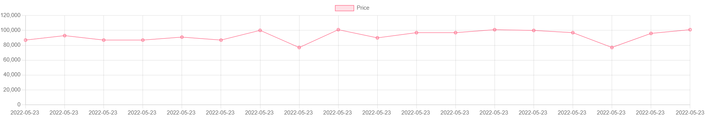

# Amazon-web-scraper / Price Tracker

First we are collecting data(web scraping) from a particular amazon product url using a python library called BeautifulSoup. Then we are stripping those data chunks to get price, product-title, date out of it using find() function. These are the column title of our csv dataset file, where we are storing the actual data. 

We have to run our python code once per day to get prices fluctuation of that product over a long time. But for now we created another dataset file with different prices for a product.

Next, we are passing that dataset file to a html file, it fetches the data from the csv. Lastly, we are creating a chart(or graph) using chart.js library in the website.

video demo below:

https://user-images.githubusercontent.com/62671853/183294258-843e5d93-dc8d-4725-b8f8-b70dbec9ba73.mp4

